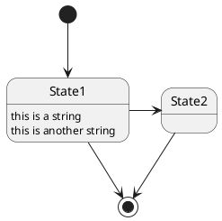

# git7

```puml
@startuml

[*] --> State1
State1 --> [*]
State1 : this is a string
State1 : this is another string

State1 -> State2
State2 --> [*]

@enduml
```

### 测试markdown功能
测试== markdown ==功能
